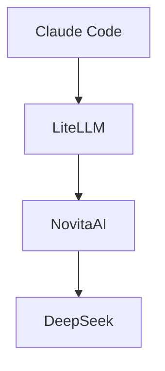

# How to use Claude Code with other models paying only per use

For a while now, I haven't been able to program in my free time as much as I would have liked.
This has made me reflect on something I believe many developers experience: having multiple
subscriptions to AI tools and premium services, but not enough time to truly take advantage of them.

Paying for Claude Pro, ChatGPT Plus, different language model APIs... when you're in a phase where
programming is not your priority, it starts to feel like money that simply disappears each month. You reach the end
of the bill and think: "did I really use all of this?"

I started thinking: is there a way to keep using Claude Code but only pay for what I use? But of course, Anthropic's
models are expensive; could I use cheaper ones from Claude Code?

I started researching cheaper models that maintained a minimum level of quality and stumbled upon DeepSeek and this
comparison table (per million tokens):

| Model                         | Input (Cache Miss) | Output  |
| ----------------------------- | ------------------ | ------- |
| DeepSeek V4 Flash (Novita AI) | $0.140             | $0.280  |
| DeepSeek V4 Pro (Novita AI)   | $1.600             | $3.200  |
| Claude 3.5 Sonnet             | $3.000             | $15.000 |
| Claude 3 Opus (4.x)           | $5.000             | $25.000 |

DeepSeek offered a much cheaper model and, a priori, a good price-to-quality ratio.

This led me to discover **LiteLLM** and how I could use it together with **DeepSeek** to achieve similar results with
significantly lower investment.

In this post, I'm sharing how I've reorganized my AI tools stack to be more efficient without sacrificing quality.

# The main idea

To avoid always having an active subscription or having to guess whether we'll use a tool at any given moment,
I decided to create a system that allows me to use any AI model at any time and pay only for the time I use it. And
all of this without giving up Claude Code, which is the programming agent I use the most right now.

And that's where **LiteLLM** comes in. LiteLLM allows (among other things) to act as a gateway for AI models.

Therefore, the idea was simple: connect Claude Code to LiteLLM and use the models that work best for me. In my case,
I went with DeepSeek, since it offers good results at a very accessible price.

But I didn't use the DeepSeek API directly since I wasn't sure if I'd want to change and try other models in the future.
That's why I decided to use **[NovitaAI](https://novita.ai/),** as it has a large catalog of AI model APIs,
all under a single API Key.



## Novita AI

Working with [NovitaAI](https://novita.ai/) was the easiest part. Just create an account, get an API Key, and you're done. NovitaAI
offers a catalog of AI models that you can use through their API, which allows you to switch models based on your needs
without having to subscribe to each one individually.

For this project, I chose:

- **[DeepSeek V4 Pro](https://novita.ai/es/models/model-detail/deepseek-deepseek-v4-pro)**
- **[DeepSeek V4 Flash](https://novita.ai/es/models/model-detail/deepseek-deepseek-v4-flash)**

_NOTE: Before you can use it, you'll need to add credits to your account._

## LiteLLM

[LiteLLM](https://www.litellm.ai/) is an open-source Python library that works as a universal translator
for AI models. Instead of learning different APIs for each provider, you use a single interface that connects
to over 100 LLM services.

Its configuration wasn't very complex for what I needed. Basically, I ran it with Docker and created the configuration
file with the models I needed. I did it in steps, first locally to do all the testing, and then I deployed it to
Hugging Face Spaces.

### Local Testing

The first thing I did was create a file called `litellm_config.yaml` in my working directory. In that file
I declared the models I needed:

```yaml
model_list:
  - model_name: Deepseek V4 Pro
    litellm_params:
      model: novita/deepseek/deepseek-v4-pro
  - model_name: Deepseek V4 Flash
    litellm_params:
      model: novita/deepseek/deepseek-v4-flash
```

Next, I created a docker-compose.yml in the same directory to run my LiteLLM along with a PostgreSQL:

```yaml
version: "3.8"

services:
  # Database for LiteLLM
  litellm-db:
    image: postgres:16-alpine
    container_name: litellm-postgres
    environment:
      POSTGRES_USER: litellm_user
      POSTGRES_PASSWORD: <litellm-db-password>
      POSTGRES_DB: litellm_db
    volumes:
      - pgdata:/var/lib/postgresql/data
    ports:
      - "5432:5432"

  # LiteLLM Server
  litellm-proxy:
    image: docker.litellm.ai/berriai/litellm:latest
    container_name: litellm-app
    ports:
      - "4000:4000"
    depends_on:
      - litellm-db
    # 👇 HERE WE DECLARE THE CONFIGURATION FILE
    volumes:
      - ./litellm_config.yaml:/app/config.yaml
    environment:
      # Remember to secure these values in production environments
      - DATABASE_URL=postgresql://litellm_user:<litellm-db-password>@litellm-db:5432/litellm_db
      - LITELLM_MASTER_KEY=<litellm-master-key> # REPLACE THIS VALUE WITH YOUR MASTER KEY
      - UI_USERNAME=<ui-username> # REPLACE THIS VALUE WITH YOUR USERNAME
      - UI_PASSWORD=<ui-password> # REPLACE THIS VALUE WITH YOUR PASSWORD
      - NOVITA_API_KEY=<novita-ai-api-key> # REPLACE THIS VALUE WITH YOUR API KEY

    # 👇 WE TELL LITELLM TO USE THAT FILE AT STARTUP
    command: ["--config", "/app/config.yaml"]

volumes:
  pgdata:
```

The names of the environment variables are not random, but are used by LiteLLM to set the different
parameters. Remember to replace the values with your own.

As you can see, one of the environment variables is `NOVITA_API_KEY`, which is the API Key I got from NovitaAI.
LiteLLM supports NovitaAI natively, so it will read that variable automatically at startup.

With all this, I was able to start the LiteLLM server and test it in the browser. To do this, I ran the following command:

```bash
docker-compose up -d
```

In the browser, I accessed `http://localhost:4000/ui` and saw the LiteLLM interface. Remember that the username
and password are the ones configured in the docker-compose file.

Once in the LiteLLM interface, I was able to test the models we had configured. To do this, I went to the section
**Models + Endpoints** and selected the model I wanted to test.


Once the model was selected, it's possible to test the connection with the **Test Connection** button.

#### Bonus: Displaying model pricing

The DeepSeek models appeared in the LiteLLM interface, but didn't show the price per token. This was something I
was interested in, since LiteLLM tracks costs based on model usage.
To see the costs of the models, I simply added the cost per token information that NovitaAI offers on its website to the
configuration file. It looked like this:

```yaml
model_list:
  - model_name: Deepseek V4 Pro
    litellm_params:
      model: novita/deepseek/deepseek-v4-pro
    model_info:
      input_cost_per_token: 0.0000016 # $1.6 per million
      output_cost_per_token: 0.0000032 # $3.2 per million
  - model_name: Deepseek V4 Flash
    litellm_params:
      model: novita/deepseek/deepseek-v4-flash
    model_info:
      input_cost_per_token: 0.00000014 # $0.14 per million
      output_cost_per_token: 0.00000028 # $0.28 per million
```

### Connecting local LiteLLM with Claude Code

Once I had LiteLLM configured, I proceeded to connect it with Claude Code. To do this, I configured Claude Code
to point to my LiteLLM server. Since I always want to use my LiteLLM, I had my
Claude Code connect through its settings file. To do this, I replaced the contents of `settings.json`
with the following:

```json
{
  "env": {
    "ANTHROPIC_BASE_URL": "http://localhost:4000",
    "ANTHROPIC_API_KEY": "<litellm-master-key>",
    "ANTHROPIC_MODEL": "opus",
    "ANTHROPIC_SMALL_FAST_MODEL": "sonnet"
  },
  "model": "sonnet[1m]"
}
```

_NOTE: If desired, you can override the environment variables directly in the terminal session where Claude Code is
going to run, so that if Claude Code is executed from another session, it will continue using the Anthropic API instead
of the LiteLLM API._

Remember to replace `<litellm-master-key>` with your LiteLLM master key.

To avoid issues with the model names shared by Claude Code, I "faked" the names of the models
that Claude Code uses in the LiteLLM configuration file, so that LiteLLM simulates using a specific model
when internally it redirects to DeepSeek:

```yaml
# (Opus)
- model_name: claude-opus-4-6
  litellm_params:
    model: novita/deepseek/deepseek-v4-pro
  model_info:
    input_cost_per_token: 0.0000016 # $1.6 per million
    output_cost_per_token: 0.0000032 # $3.2 per million
    cache_read_input_cost_per_token: 0.000000135 # $0.135 per million
- model_name: opus
  litellm_params:
    model: novita/deepseek/deepseek-v4-pro
  model_info:
    input_cost_per_token: 0.0000016 # $1.6 per million
    output_cost_per_token: 0.0000032 # $3.2 per million
    cache_read_input_cost_per_token: 0.000000135 # $0.135 per million

# Sonnet
- model_name: claude-sonnet-4-6
  litellm_params:
    model: novita/deepseek/deepseek-v4-flash
  model_info:
    input_cost_per_token: 0.00000014 # $0.14 per million
    output_cost_per_token: 0.00000028 # $0.28 per million
    cache_read_input_cost_per_token: 0.000000028 # $0.028 per million
- model_name: sonnet
  litellm_params:
    model: novita/deepseek/deepseek-v4-flash
  model_info:
    input_cost_per_token: 0.00000014 # $0.14 per million
    output_cost_per_token: 0.00000028 # $0.28 per million
    cache_read_input_cost_per_token: 0.000000028 # $0.028 per million
```

With this, I was able to use Claude Code with LiteLLM locally using DeepSeek models. And the best part is
that, if at any point I want to change models, I just have to modify the LiteLLM configuration file and
restart the container.

## Deploying on Hugging Face Spaces

My goal was not just to be able to use LiteLLM locally, but to have an experience similar to using Claude Code
"natively" but with other cheaper and more efficient models, without the need for extra configurations.

That's why I used [Hugging Face Spaces](https://huggingface.co/spaces) to deploy the LiteLLM server along with
[Supabase](https://supabase.com/) for the database.

### Supabase

Supabase is a database-as-a-service (PaaS) platform that allows you to create databases in the cloud.
With Supabase, you can create a PostgreSQL database in the cloud and connect it to your application without having to
worry about the infrastructure.

When you open an account, Supabase itself offers a guide to create a cloud database for free.

However, to use Supabase on Hugging Face Spaces, you need to get the database URL, which
you can extract from the section **Get Connected** -> **Direct**; **Session Method** -> **Session pooler**;
**Type** -> **URI**.


No further configuration is required in Supabase, since we only need the database URL with its
password. Supabase takes care of the rest.

### Hugging Face Spaces

Hugging Face Spaces is a platform that allows users to deploy machine learning models and create
interactive AI applications. Additionally, it supports running Dockerized applications.

To do this, I created a Space with the Docker SDK. Next, I added the LiteLLM configuration file that
I had in the local environment to the Space.
Finally, I created a `Dockerfile` that contained the necessary commands to run the LiteLLM server.
Here it is:

```dockerfile
FROM docker.litellm.ai/berriai/litellm:latest

# Expose the required Hugging Face Spaces port
EXPOSE 7860
ENV PORT=7860

# Copy your configuration file from the Space root to the container
COPY litellm_config.yaml /app/config.yaml

# 🔗 Connect the Supabase database
ENV DATABASE_URL=${DATABASE_URL}

# 🔐 Connect the web panel security and Claude Code
ENV LITELLM_MASTER_KEY=${LITELLM_MASTER_KEY}
ENV UI_USERNAME=${UI_USERNAME}
ENV UI_PASSWORD=${UI_PASSWORD}

# 🔗 API KEY for Novita AI
ENV NOVITA_API_KEY=${NOVITA_API_KEY}


# Start indicating the path to the copied file and the correct port
CMD ["--config", "/app/config.yaml", "--port", "7860"]
```

As you can see, there are no hardcoded keys, but I added them as a "Secret" in Hugging Face, in the
**Settings** -> **Secrets** tab.


Once the files are uploaded, Hugging Face automatically deploys the Space.
Once deployed, I was able to access my LiteLLM from the browser. Just access
`https://<username>-<space-name>.hf.space/ui` to see the LiteLLM interface already configured with the models.

### Claude Code with remote LiteLLM

Finally, I needed to connect my Claude Code to my remote LiteLLM. Similarly to what we saw earlier,
I modified the `settings.json` file of Claude Code to point to my remote LiteLLM. The file ended up like this:

```json
{
  "env": {
    "ANTHROPIC_BASE_URL": "https://<username>-<space-name>.hf.space",
    "ANTHROPIC_API_KEY": "<LITELLM_MASTER_KEY>",
    "ANTHROPIC_MODEL": "opus",
    "ANTHROPIC_SMALL_FAST_MODEL": "sonnet"
  },
  "model": "sonnet[1m]"
}
```

Now, when I run Claude Code, I can already use the LiteLLM models.

## Conclusion

In summary, I've managed to connect Claude Code with LiteLLM, using DeepSeek models through NovitaAI.
This allows me to have a flexible and economic system for using AI models without the need for
recurring subscriptions or usage limitations.

For now, I'm very happy with the result. I keep using Claude Code, I only pay for what I use, without the need for
subscriptions, and I can switch models quickly and easily.
Of course, this doesn't replace Anthropic in all scenarios, but for personal projects it seems like a good complement.

We'll see how it’ll perform in the future when I make more intensive use of AI for programming and how I can improve it.
