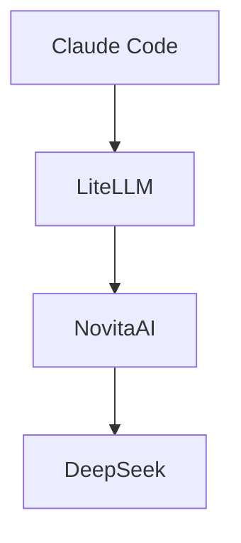

# Cómo usar Claude Code con otros modelos pagando solo por uso

Por razones de la vida, he estado un tiempo sin poder programar en mi tiempo libre todo lo que me hubiese gustado.
Y eso me ha hecho reflexionar sobre algo que creo que muchos desarrolladores experimentamos: tener múltiples
suscripciones a herramientas de IA y servicios premium, pero sin el tiempo suficiente para aprovecharlas realmente.

Pagar por Claude Pro, ChatGPT Plus, diferentes APIs de modelos de lenguaje... cuando estás en una etapa donde la
programación no es tu prioridad, empieza a sentirse como dinero que simplemente desaparece cada mes. Llegas al final
de la factura y piensas: "¿realmente usé todo esto?"

Empecé a pensar: ¿habrá alguna forma de seguir utilizando Claude Code pero pagando por uso? Pero claro, los modelos
de Anthropic son caros, ¿podría usar otros más baratos desde Claude Code?

Me puse a investigar modelos más baratos que mantuviesen un mínimo de calidad y topé con DeepSeek y esta tabla
comparativa (por millón de tokens):

| Modelo                        | Entrada (Cache Miss) | Salida  |
| ----------------------------- | -------------------- | ------- |
| DeepSeek V4 Flash (Novita AI) | $0.140               | $0.280  |
| DeepSeek V4 Pro (Novita AI)   | $1.600               | $3.200  |
| Claude 3.5 Sonnet             | $3.000               | $15.000 |
| Claude 3 Opus (4.x)           | $5.000               | $25.000 |

DeepSeek ofrecía un modelo mucho más barato y, a priori, una buena relación calidad-precio.

Todo esto me llevó a descubrir **LiteLLM** y cómo puedo usarlo junto con **DeepSeek** para obtener resultados similares
con una inversión mucho menor.

En este post, te comparto cómo he reorganizado mi stack de herramientas de IA para ser más eficiente sin sacrificar
calidad.

# La idea principal

Para evitar tener una suscripción siempre activa, o tener que adivinar si usaremos una herramienta en un momento dado,
decidí crear un sistema que me permita utilizar un modelo de IA en cualquier momento, y pagando solo por el tiempo que
utilice. Y todo ello sin renunciar a Claude Code, el cual es el agente de programación que más utilizo ahora mismo.

Y ahí es donde entra **LiteLLM**. LiteLLM permite (entre otras cosas) actuar como un gateway para los modelos de IA.

Por tanto, la idea era sencilla: conectar Claude Code a LiteLLM y usar los modelos que más me convengan. En mi caso,
me decanté por DeepSeek, ya que ofrece unos buenos resultados a un precio muy accesible.

Pero no utilicé la API de DeepSeek directamente dado que no sé si querré cambiar y probar otros modelos en un futuro.
Por eso, decidí utilizar **[NovitaAI](https://novita.ai/),** ya que tiene un gran catálogo de APIs de modelos de IA,
todas bajo una misma API Key.



## Novita AI

Trabajar con [NovitaAI](https://novita.ai/) fue la parte más sencilla. Basta con crear una cuenta, obtener una API Key y
listo. NovitaAI ofrece un catálogo de modelos de IA que puedes usar a través de su API, lo que te permite cambiar de
modelo según tus necesidades sin tener que suscribirte a cada uno individualmente.

Para este proyecto, yo elegí:

- **[DeepSeek V4 Pro](https://novita.ai/es/models/model-detail/deepseek-deepseek-v4-pro)**
- **[DeepSeek V4 Flash](https://novita.ai/es/models/model-detail/deepseek-deepseek-v4-flash)**

_NOTA: Antes de poder usarlo, necesitarás añadir créditos a tu cuenta._

## LiteLLM

[LiteLLM](https://www.litellm.ai/) es una biblioteca Python de código abierto que funciona como traductor universal
para modelos de IA. En lugar de aprender diferentes API para cada proveedor, utilizas una única interfaz que se conecta
a más de 100 servicios LLM.

Su configuración no fue muy compleja para lo que yo necesitaba. Básicamente, lo ejecuté con Docker y cree el fichero de
configuración con los modelos que necesitaba. Lo hice por pasos, primero en local para hacer todas las pruebas, y
después lo desplegué en Hugging Face Spaces.

### Pruebas en local

Lo primero que hice fue crear un archivo llamado `litellm_config.yaml` en mi directorio de trabajo. En ese fichero
declaré los modelos que necesitaba:

```yaml
model_list:
  - model_name: Deepseek V4 Pro
    litellm_params:
      model: novita/deepseek/deepseek-v4-pro
  - model_name: Deepseek V4 Flash
    litellm_params:
      model: novita/deepseek/deepseek-v4-flash
```

A continuación, creé un docker-compose.yml en el mismo directorio para ejecutar mi LiteLLM junto con un PostgresSQL:

```yaml
version: "3.8"

services:
  # Base de datos para LiteLLM
  litellm-db:
    image: postgres:16-alpine
    container_name: litellm-postgres
    environment:
      POSTGRES_USER: litellm_user
      POSTGRES_PASSWORD: <litellm-db-password>
      POSTGRES_DB: litellm_db
    volumes:
      - pgdata:/var/lib/postgresql/data
    ports:
      - "5432:5432"

  # Servidor LiteLLM
  litellm-proxy:
    image: docker.litellm.ai/berriai/litellm:latest
    container_name: litellm-app
    ports:
      - "4000:4000"
    depends_on:
      - litellm-db
    # 👇 AQUÍ DECLARAMOS EL ARCHIVO DE CONFIGURACIÓN
    volumes:
      - ./litellm_config.yaml:/app/config.yaml
    environment:
      # Recuerda segurizar estos valores en entornos productivos
      - DATABASE_URL=postgresql://litellm_user:<litellm-db-password>@litellm-db:5432/litellm_db
      - LITELLM_MASTER_KEY=<litellm-master-key> # SUSTITUYE ESTE VALOR POR TU MASTER KEY
      - UI_USERNAME=<ui-username> # SUSTITUYE ESTE VALOR POR TU USERNAME
      - UI_PASSWORD=<ui-password> # SUSTITUYE ESTE VALOR POR TU PASSWORD
      - NOVITA_API_KEY=<novita-ai-api-key> # SUSTITUYE ESTE VALOR POR TU API KEY

    # 👇 LE DECIMOS A LITELLM QUE USE ESE ARCHIVO AL ARRANCAR
    command: ["--config", "/app/config.yaml"]

volumes:
  pgdata:
```

Los nombres de las variables de entorno no son aleatorios, sino usados por LiteLLM para establecer los distintos
parámetros. Recuerda sustituir los valores por los tuyos propios.

Como puedes ver, una de las variables de entorno es `NOVITA_API_KEY`, que es el APIKey que obtuve en NovitaAI.
**LiteLLM soporta NovitaAI de forma nativa**, por lo que leerá esa variable automáticamente al arrancar.

Con todo esto, pude arrancar el servidor de LiteLLM y probarlo en el navegador. Para ello, ejecuté el siguiente comando:

```bash
docker-compose up -d
```

En el navegador, accedí a `http://localhost:4000/ui` y ví la interfaz de LiteLLM. Recuerda que el usuario
y la contraseña son los configurados en el fichero de docker compose.

Ya en la interfaz de LiteLLM, pude probar los modelos que configurados. Para ello, fui a la sección de
**Models + Endpoints** y seleccioné el modelo que quería probar.


Una vez seleccionado el modelo, es posible probar la conexión con el botón **Test Connection**.

#### Bonus: Mostrar el precio de los modelos

Los modelos de DeepSeek aparecían en la interfaz de LiteLLM, pero no mostraban el precio por token. Esto es algo que me
interesaba, ya que LiteLLM hace un seguimiento de los costes en función del uso de los modelos.
Para poder ver los costes de los modelos, simplemente introduje en el fichero de configuración los costes por token que
NovitaAI ofrece en su web. Quedó de la siguiente manera:

```yaml
model_list:
  - model_name: Deepseek V4 Pro
    litellm_params:
      model: novita/deepseek/deepseek-v4-pro
    model_info:
      input_cost_per_token: 0.0000016 # $1.6 por millón
      output_cost_per_token: 0.0000032 # $3.2 por millón
  - model_name: Deepseek V4 Flash
    litellm_params:
      model: novita/deepseek/deepseek-v4-flash
    model_info:
      input_cost_per_token: 0.00000014 # $0.14 por millón
      output_cost_per_token: 0.00000028 # $0.28 por millón
```

### Conectar LiteLLM local con Claude Code

Una vez tenía LiteLLM configurado, pasé a conectarlo con Claude Code. Para ello, configuré Claude Code
para que apuntase a mi servidor de LiteLLM. Dado que yo siempre quiero utilizar mi LiteLLM, hice que mi
Claude Code se conecte a través de su fichero de settings. Para ello, sustituí el contenido de `settings.json`
por el siguiente:

```json
{
  "env": {
    "ANTHROPIC_BASE_URL": "http://localhost:4000",
    "ANTHROPIC_API_KEY": "<litellm-master-key>",
    "ANTHROPIC_MODEL": "opus",
    "ANTHROPIC_SMALL_FAST_MODEL": "sonnet"
  },
  "model": "sonnet[1m]"
}
```

_NOTA: Si se desea, se pueden sobreescribir las variables de entorno directamente en la sesión de la terminal donde se va
a ejecutar Claude Code, de forma que si se ejecuta Claude Code desde otra sesión, seguirá utilizando la API de Anthropic
en lugar de la API de LiteLLM._

Recuerda sustituir `<litellm-master-key>` por tu master key de LiteLLM.

Para evitar problemas con los nombres de los modelos compartidos por Claude Code, "falseé" los nombres de los modelos
que Claude Code usa en el fichero de configuración de LiteLLM, de forma que LiteLLM simula utilizar un modelo en
concreto cuando internamente redirige a Deepseek:

```yaml
# (Opus)
- model_name: claude-opus-4-6
  litellm_params:
    model: novita/deepseek/deepseek-v4-pro
  model_info:
    input_cost_per_token: 0.0000016 # $1.6 por millón
    output_cost_per_token: 0.0000032 # $3.2 por millón
    cache_read_input_cost_per_token: 0.000000135 # $0.135 por millón
- model_name: opus
  litellm_params:
    model: novita/deepseek/deepseek-v4-pro
  model_info:
    input_cost_per_token: 0.0000016 # $1.6 por millón
    output_cost_per_token: 0.0000032 # $3.2 por millón
    cache_read_input_cost_per_token: 0.000000135 # $0.135 por millón

# Sonnet
- model_name: claude-sonnet-4-6
  litellm_params:
    model: novita/deepseek/deepseek-v4-flash
  model_info:
    input_cost_per_token: 0.00000014 # $0.14 por millón
    output_cost_per_token: 0.00000028 # $0.28 por millón
    cache_read_input_cost_per_token: 0.000000028 # $0.028 por millón
- model_name: sonnet
  litellm_params:
    model: novita/deepseek/deepseek-v4-flash
  model_info:
    input_cost_per_token: 0.00000014 # $0.14 por millón
    output_cost_per_token: 0.00000028 # $0.28 por millón
    cache_read_input_cost_per_token: 0.000000028 # $0.028 por millón
```

Con esto, ya pude utilizar Claude Code con LiteLLM en local usando los modelos de DeepSeek. Y lo mejor de todo es
que, si en algún momento quiero cambiar de modelo, solo tengo que modificar el fichero de configuración de LiteLLM y
reiniciar el contenedor.

## Desplegando en Hugging Face Spaces

Mi objetivo no era el poder utilizar LiteLLM en local, sino tener una experiencia similar a utilizar Claude Code
"de forma nativa" pero con otros modelos más baratos y eficientes, sin necesidad de configuraciones extras.

Por ello, utilicé [Hugging Face Spaces](https://huggingface.co/spaces) para desplegar el servidor de LiteLLM junto con
[Supabase](https://supabase.com/) para la base de datos.

### Supabase

Supabase es una plataforma de bases de datos como servicio (PaaS) que te permite crear bases de datos en la nube.
Con Supabase, puedes crear una base de datos PostgreSQL en la nube y conectarla a tu aplicación sin necesidad de
preocuparte por la infraestructura.

Al abrir la cuenta, el propio Supabase ofrece una guía para poder crear una base de datos en la nube de forma gratuita.

Eso sí, para poder utilizar Supabase en Hugging Face Spaces, es necesario obtener la URL de la base de datos, la cual
la puedes extraer de la sección **Get Connected** -> **Direct**; **Session Method** -> **Session pooler**;
**Type** -> **URI**.


No se requiere de una mayor configuración en Supabase, ya que solo necesitamos la URL de la base de datos con su
contraseña. Supabase hace el resto.

### Hugging Face Spaces

Hugging Face Spaces es una plataforma que permite a los usuarios desplegar modelos de aprendizaje automático y crear
aplicaciones interactivas de IA. Además, soporta la ejecución de aplicaciones Dockerizadas.

Para ello, creé un Space con el SDK de Docker. A continuación, añadí el fichero de configuración de LiteLLM que
tenía en el entorno local al Space.
Por último, crea un fichero `Dockerfile` que contenía los comandos necesarios para ejecutar el servidor de LiteLLM.
Aquí te lo dejo:

```dockerfile
FROM docker.litellm.ai/berriai/litellm:latest

# Exponer el puerto obligatorio de Hugging Face Spaces
EXPOSE 7860
ENV PORT=7860

# Copiar tu archivo de configuración de la raíz del Space hacia el contenedor
COPY litellm_config.yaml /app/config.yaml

# 🔗 Conectar la base de datos de Supabase
ENV DATABASE_URL=${DATABASE_URL}

# 🔐 Conectar la seguridad del panel web y Claude Code
ENV LITELLM_MASTER_KEY=${LITELLM_MASTER_KEY}
ENV UI_USERNAME=${UI_USERNAME}
ENV UI_PASSWORD=${UI_PASSWORD}

# 🔗 API KEY para Novita AI
ENV NOVITA_API_KEY=${NOVITA_API_KEY}


# Arrancar indicando la ruta del archivo copiado y el puerto correcto
CMD ["--config", "/app/config.yaml", "--port", "7860"]
```

Como se puede ver, ahora no hay ninguna clave hardcodeada, sino que las añadí como un "Secret" en Hugging Face, en la
pestaña de **Settings** -> **Secrets**.


Una vez subidos los ficheros, Hugging Face despliega el Space automáticamente.
Una vez desplegado, pude acceder a mi LiteLLM desde el navegador. Basta con acceder a
`https://<username>-<space-name>.hf.space/ui` para ver la interfaz de LiteLLM ya configurada con los modelos.

### Claude Code con LiteLLM remoto

Por último, me faltaba conectar mi Claude Code ahora a mi LiteLLM remoto. De forma similar a lo visto anteriormente,
modifiqué el fichero `settings.json` de Claude Code para que apunte a mi LiteLLM remoto. El fichero quedó de la
siguiente manera:

```json
{
  "env": {
    "ANTHROPIC_BASE_URL": "https://<username>-<space-name>.hf.space",
    "ANTHROPIC_API_KEY": "<LITELLM_MASTER_KEY>",
    "ANTHROPIC_MODEL": "opus",
    "ANTHROPIC_SMALL_FAST_MODEL": "sonnet"
  },
  "model": "sonnet[1m]"
}
```

Ahora, cuando ejecuto Claude Code, ya puedo utilizar los modelos de LiteLLM.

## Conclusión

En resumen, he logrado conectar Claude Code con LiteLLM, utilizando los modelos de DeepSeek a través de NovitaAI.
Esto me permite tener un sistema flexible y económico para utilizar modelos de IA sin necesidad de suscripciones
recurrentes o limitaciones de uso.

Por ahora, estoy muy contento con el resultado. Sigo usando Claude Code, pago únicamente por uso, sin necesidad de
suscripciones, y puedo cambiar de modelo de forma rápida y sencilla.
Por supuesto, esto no sustituye a Anthropic en todos los escenarios, pero para proyectos personales me parece un buen
complemento.

Veremos como responde en el futuro cuando vuelva a hacer un uso más
intensivo de la IA para programar y cómo podré mejorarlo.
